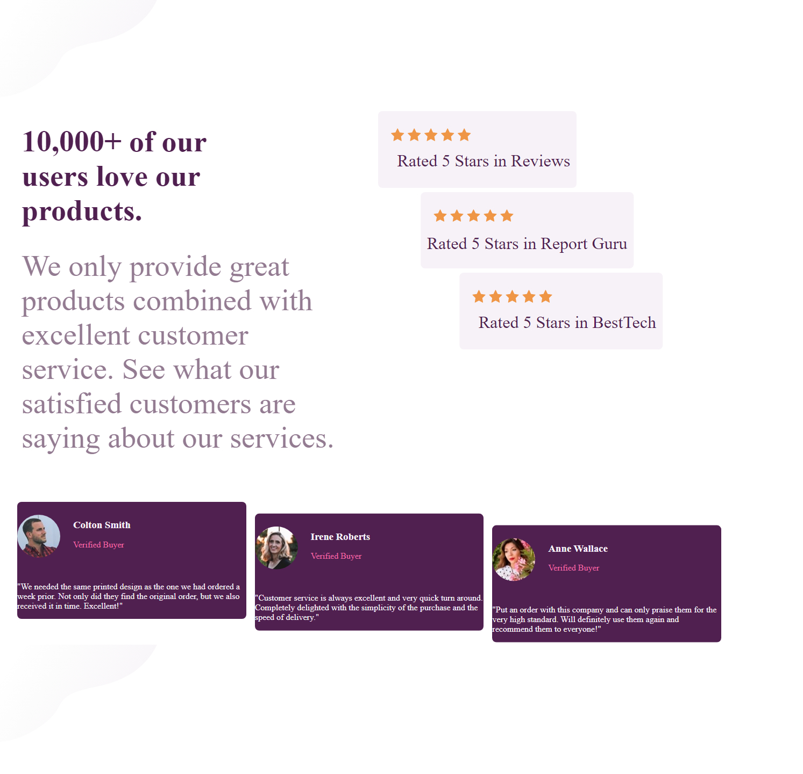

# Frontend Mentor - Social proof section

## the project is a front end mentor challenge, of a rewiew of a social proof ,  review, . It was done enhance my learning, from web3-bridge.  

## The project was done with only HTML and CSS, using  various syntax, to acconplish the project

### 1 HTML
### 2 CSS
### FLEX-BOX

## The project  was made respomsive using @media query

